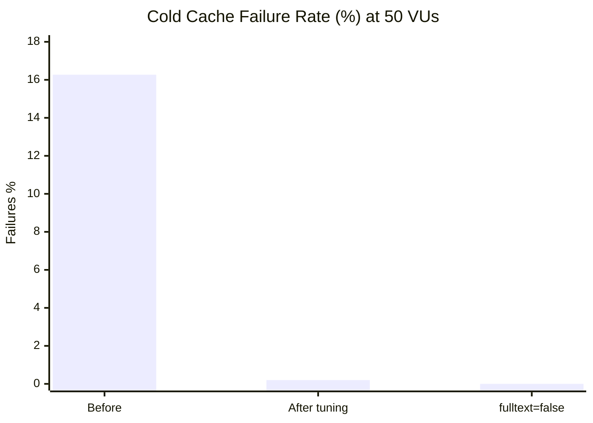
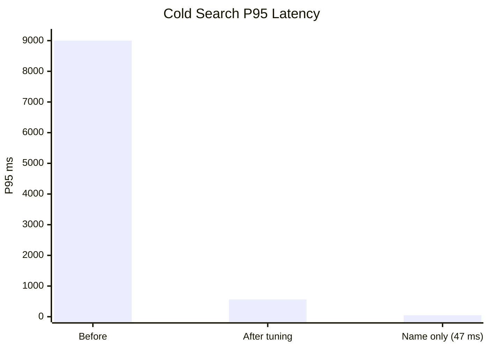
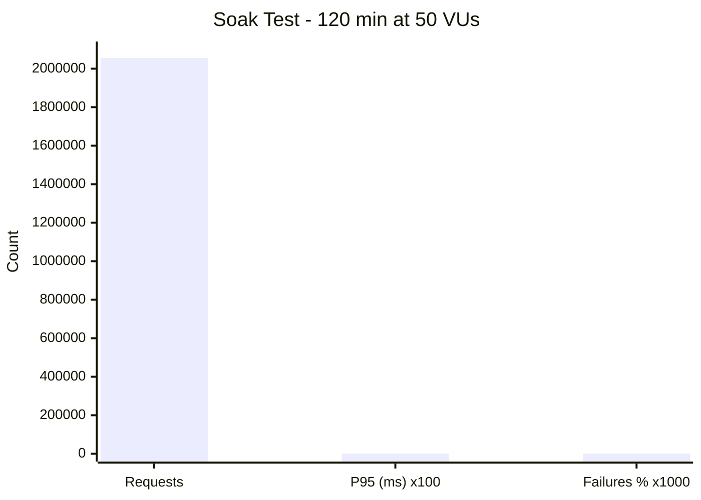
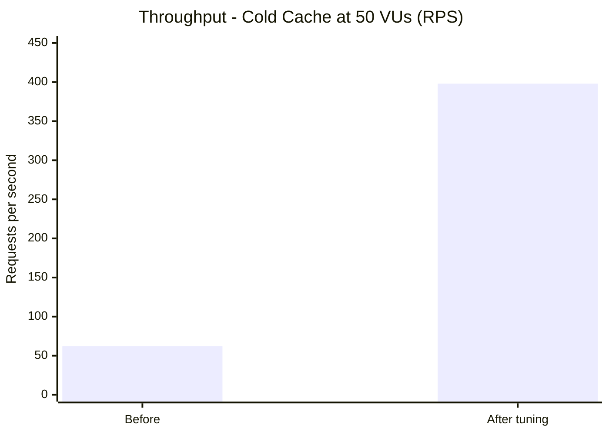
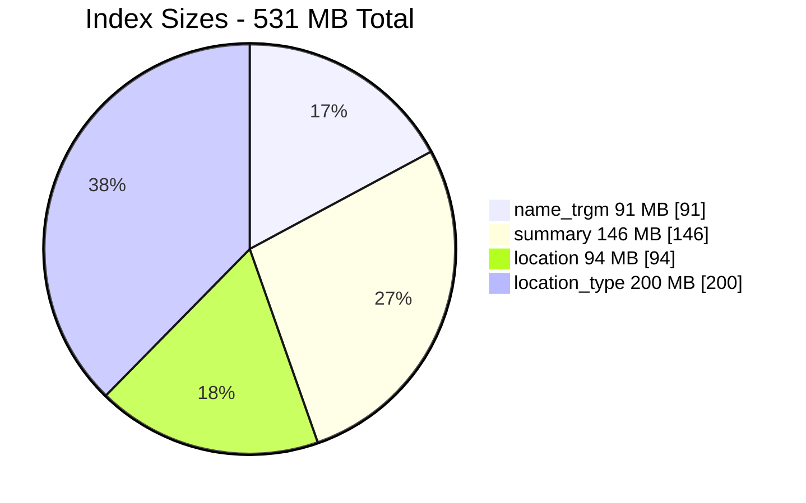

# unified-my3pai-place-service

Unified place data store and query API. Provider-agnostic PostgreSQL + PostGIS backend for tourism, POI and general place data. The schema does not assume any source. Adding a new source requires no schema change.

Status: production at `fw.my3p.ai` (16 CPU / 8 GB RAM) / 1.35M entities, PostGIS 16, Redis, 8 Uvicorn workers.

## Contents

* [Why this exists](#why-this-exists)
* [Key properties](#key-properties)
* [Architecture](#architecture)
* [Data model](#data-model)
* [API](#api)
* [Performance - proven at 1.35M entities and 2M requests](#performance---proven-at-135m-entities-and-2m-requests)
* [Operations](#operations)
* [Tech stack](#tech-stack)
* [Getting started](#getting-started)
* [Configuration](#configuration)
* [Project structure](#project-structure)
* [Deployment](#deployment)
* [Notes](#notes)

## Why this exists

Tourism data comes from many providers with different schemas, quality and update cycles. Frontend applications need a single, fast query layer that hides provider differences and handles spatial and text queries at scale.

This service solves that: one table for places, provider-specific fields in JSONB, unified taxonomy on top, with search, nearby, map and detail endpoints. External importers write data. This service does not scrape or fetch.

## Key properties

* **Provider-agnostic schema.** `source` and `place_type` are plain VARCHAR. `attributes` JSONB holds provider fields. `source` + `source_id` is unique, so the same real-world place from two providers is two rows.
* **Spatial and text search that scales.** PostGIS `ST_DWithin` and `ST_Intersects` with `ST_SetSRID(ST_MakePoint(...),4326)::geography`, trigram search via `pg_trgm` (`op('%')` backed by GIN), single-pass total counts with `COUNT(*) OVER()`.
* **Cache designed for real traffic.** Redis with SHA-256 keys `dmo:{endpoint}:{hash}`, separate TTLs (5 min search/nearby/map, 30 min detail, 60 s open status), `SET NX` stampede lock with wait and retry, invalidation before commit, pattern-based invalidation with bulk optimization.
* **Correct concurrency.** `pg_advisory_xact_lock(hash(source) % 2^31)` per source, IntegrityError retry, REPEATABLE_READ isolation, soft deletes with `is_active` filtering.
* **Security defaults.** `X-API-Key` via `APIKeyHeader` on all writes (fails startup if empty), parameterized SQL only (`text(...).bindparams`), `set_config` for statement timeout, `html.escape` + `bleach` for description transforms, per-IP Redis sliding window rate limiting with `X-Forwarded-For` support.
* **Operability.** Structured logging with `structlog`, Prometheus metrics, `/health` with per-component 1.5 s timeout, statement and request timeouts, request ID validation as UUID.

## Architecture

```
Frontend (my3pai)
  -> Read API (public) / Write API (keyed) / Admin UI (HTMX) / Admin scripts (auto-discovered)
    -> Services: search, spatial, detail, cache, write, taxonomy, pagination
      -> PostgreSQL 16 + PostGIS + Redis
        Tables: entities, media, classifications, routes, unified_categories, place_type_mappings
```

Service layer is routers -> services -> database. SQLModel for tables, Pydantic for schemas, Alembic for migrations.

## Data model

**Core tables:**

| Table | Purpose | Key fields |
|---|---|---|
| `entities` | Place data | id, source, source_id, name, slug, place_type, location (geography), country, region_names, attributes (JSONB), unified_category, quality_score |
| `media` | Photos and video | id, entity_id, media_type, url, thumbnail_url |
| `classifications` | Tags and categories | id, entity_id, category_class, value_code |
| `routes` | Routes and tours | id, entity_id, route_type, distance_km, gpx_xml |
| `unified_categories` | Taxonomy | id, slug, level, parent_id |

**Rules:**

* No provider-prefixed columns. Provider fields go to `attributes`.
* JSONB numeric queries cast explicitly: `(attributes->>'distance_km')::numeric`.
* `description` rendering respects `description_format` (prosemirror to HTML, escaped).
* Open status (`is_open`, `opens_at`, `closes_at`) is fetched separately with 60 s TTL and merged at response time.

Current production inventory is about 1.35M active entities across six sources, with 52k classifications and 13k media rows.

## API

### Read (public)

```
GET /search?q=&source=&place_type=&country=&unified_category=&page_size=&cursor=&fulltext=
GET /nearby?lat=&lon=&radius_km=&source=&place_type=&unified_category=&page_size=&cursor=
GET /map?bbox=&source=&place_type=&unified_category=&page_size=&cursor=
GET /{source}/{source_id}
GET /classifications?entity_id=&category=&value_code=&page_size=&cursor=
GET /classifications/categories
GET /unified-categories
```

Paginated responses: `{ results: [...], total: N, next_cursor: "...", has_more: bool }`. Errors: `{ error, message, code, request_id }`. All entity responses include `attributes`.

Cursor pagination uses base64-encoded JSON with helpers in `services/pagination.py`. `fulltext=true` extends search to `summary` (slower on cold cache, opt-in).

### Write (requires `X-API-Key`)

```
POST /entities
POST /entities/bulk        # max 1000, advisory lock per source
PUT  /{source}/{source_id}
DELETE /{source}/{source_id}   # soft delete
POST /media
DELETE /media/{media_id}
POST /classifications
DELETE /classifications/{classification_id}
```

### System and admin

```
GET /health
GET /metrics
GET /admin/                 # dashboard, entity browser, script runner, taxonomy editor
```

Route ordering matters: `/classifications/categories` and delete routes are registered before the catch-all `/{source}/{source_id}`.

## Performance - proven at 1.35M entities and 2M requests

All numbers below are from `k6` on staging with the production dataset (1.2M entities at test time, now 1.35M). Tests run against the same code and data that is in production.

**Highlights:**

* 0 failures for 2,056,044 requests in 120 min soak at 50 VUs, P95 7.3 ms, stable memory
* Cold cache failure rate from 16.27 percent to 0.20 percent after tuning, and to 0.00 percent with `fulltext=false`
* Name-only search 47 ms cold versus 2.8 s with summary, 136x faster at P95 after the `fulltext` flag
* Ramp test scale from about 58 VUs to about 130 VUs before errors, with 67 percent less CPU and 50 percent less RAM
* Spatial and text queries sustain 50 VUs with 0 percent failures warm







**Selected results after Phase 3 (Postgres and Redis tuning, 4 partial indexes, pool/timeout tuning):**

| Scenario | VUs | Duration | Requests | Failures | P95 | Notes |
|---|---|---|---|---|---|---|
| Cold cache, default (`fulltext=false`) | 50 | 2 min | 21,354 | 0.20 percent | 562 ms | 47 ms for name-only, 2.8 s if summary included |
| Cold cache, fulltext | 50 | 2 min | 398 RPS | 0.00 percent | 87 ms | opt-in summary search |
| Warm cache | 10 | 2 min | 10,183 | 0 percent | 48 ms | steady state |
| Ramp 50 to 800 | 50 to 800 | 15 min | 236,955 | 4.12 percent | 2,833 ms | first errors near 130 VUs |
| Peak | 800 | 5 min | 124,530 | 0.52 percent | 5,550 ms | Redis 1 GB LRU, DB pool is limit |
| Soak | 50 | 120 min | 2,056,044 | 0 percent | 7.3 ms | no growth over 2 hours |
| Spatial dense bbox | 50 | 5 min | 13,254 | 0.24 percent | 1,109 ms | about 2.7 s on 4 CPU at 10 GB traffic |
| Bulk single-source | 5 | 2 min | 628 batches | 58 percent | 454 ms | serialized by advisory lock |
| Bulk multi-source | 8 | 2 min | 910 batches | 0 percent | 556 ms | per-source lock isolation |

**What changed to get there:**

| Area | Before | After | Impact |
|---|---|---|---|
| `work_mem` / `shared_buffers` / `maintenance_work_mem` | 4 MB / 128 MB / 64 MB | 32 MB / 1.5 GB / 512 MB | cold cache P95 9,000 ms to 562 ms |
| `POOL_SIZE` / `MAX_OVERFLOW` | 10 / 5 | 20 / 10 | eliminated pool exhaustion at 50 VUs |
| `QUERY_TIMEOUT_SECONDS` | 10 | 30 | spatial bbox headroom |
| `fulltext` flag | always search `summary` | `name` only by default | 2.8 s to 47 ms cold, 13.4x more RPS |
| Indexes (531 MB) | none | `idx_entities_name_trgm_active` 91 MB, `summary` 146 MB, `location` 94 MB, `location_type` 200 MB | trigram and spatial bound by index |
| Redis `maxmemory` / `policy` | unlimited / noeviction | 1 GB / allkeys-lru | peak 800 VUs from 99 percent to 0.52 percent failures |





**Capacity guidance on 4 CPU / 3 GB (current staging, prod is 16 CPU / 8 GB):**

* Safe: up to about 50 concurrent users or 200 RPS warm, P95 under 50 ms
* Warning: 50 to 130 VUs, P95 50 to 500 ms, DB pool 16 to 27 of 30
* Limit: over 130 VUs errors rise, spatial is first to degrade, writes stay at about 1 batch per second per source (advisory lock) and about 8 per second across sources

Reproduce: `loadtest/run_all.sh` and `k6 run loadtest/search.js --env BASE_URL=http://10.0.2.10:8000`. Full logs in `loadtest/` and `results/`. Regenerate API docs with `uv run python scripts/export-openapi.py`.

<p align="right"><a href="#contents">Back to top</a></p>

## Operations

**Caching:** `src/dmo/services/cache.py` implements SHA-256 keys, 5 s `SET NX` lock, 50 ms poll for waiters. Invalidation clears eight `dmo:*` patterns for single writes, single `dmo:*` SCAN for bulk over 20 entities, always before commit.

**Reliability:** bulk upsert batches locations with a single SQL update, deduplicates input, and retries on IntegrityError. Health checks hit DB and Redis with 1.5 s timeout each.

**Rate limiting:** `src/dmo/middleware/rate_limit.py`, per-IP sorted set sliding window, `count-before-add` to avoid self-count race, respects `TRUST_PROXY_HEADERS`.

## Tech stack

Python 3.12 / FastAPI / SQLModel / asyncpg / Alembic / PostgreSQL 16 + PostGIS / Redis / uv / structlog / Prometheus / Jinja2 + HTMX

## Getting started

```bash
uv sync
cp .env.example .env   # set DATABASE_URL, DATABASE_URL_SYNC, REDIS_URL, API_KEY
uv run fastapi dev src/dmo/main.py
```

```bash
uv run pytest tests/          # 244 tests, requires real PostGIS
uv run ruff check src/ tests/
uv run ruff format src/ tests/
```

Tests use a real PostGIS instance, not SQLite. Cache is disabled in tests. Imports in tests are function-local to avoid app init at collection time.

## Configuration

| Variable | Default | Notes |
|---|---|---|
| `DATABASE_URL` | required | asyncpg |
| `DATABASE_URL_SYNC` | required | psycopg2 for Alembic |
| `REDIS_URL` | redis://localhost:6379/0 |  |
| `API_KEY` | required | fails startup if empty |
| `CACHE_TTL` | 300 | seconds |
| `RATE_LIMIT_ENABLED` | true |  |
| `RATE_LIMIT_MAX_REQUESTS` | 1000 | per window per IP |
| `RATE_LIMIT_WINDOW_SECONDS` | 60 |  |
| `TRUST_PROXY_HEADERS` | true | use X-Forwarded-For |
| `POOL_SIZE` | 10 | per worker, prod 20 |
| `MAX_OVERFLOW` | 5 | per worker, prod 10 |
| `QUERY_TIMEOUT_SECONDS` | 10.0 | read, prod 30 |
| `REQUEST_TIMEOUT_SECONDS` | 30.0 |  |
| `LOG_LEVEL` | INFO | prod WARNING |

## Project structure

```
src/dmo/
  main.py
  config.py
  db.py
  logging.py
  metrics.py
  exceptions.py
  api/router.py, health.py, metrics.py
  admin/router.py, templates/, settings_manager.py
  admin_scripts/base.py, registry.py, *.py
  middleware/request_id.py, rate_limit.py
  models/database.py, schemas.py
  services/cache.py, search.py, spatial.py, detail.py, taxonomy.py, write.py, pagination.py, classifications.py
tests/
migrations/
scripts/deploy.sh, db-backup.sh, db-restore.sh, export-openapi.py
loadtest/
docs/openapi.json, index.html
```

Admin scripts are auto-discovered via `pkgutil` in `admin_scripts/registry.py`. Each script supports dry run, batching and progress callbacks. The admin UI lists them at `/admin/scripts`.

## Deployment

```bash
./scripts/deploy.sh --test      # 10.0.1.8
./scripts/deploy.sh --staging   # 10.0.2.10
./scripts/deploy.sh --prod      # fw.my3p.ai
./scripts/deploy.sh --prod --dry-run
```

Each environment has its own compose file (`docker-compose.{test,staging,prod}.yml`) deployed as `docker-compose.yml` on the target. The Dockerfile is multi-stage with `uv` and runs Alembic before starting Uvicorn with 8 workers. Backups: `scripts/db-backup.sh` and `scripts/db-restore.sh` support `--test`, `--remote` (staging) and `--prod`.

## Notes

* Spatial inserts: ORM insert first, then raw SQL `UPDATE entities SET location = ST_SetSRID(ST_MakePoint(:lon,:lat),4326)` for the geography column.
* String fields are stripped via `model_validator(mode='before')`, not `Field(strip_whitespace)`.
* `unified_categories.slug` is immutable after creation. Admin UI disables it on edit and the backend excludes it from updates.
* Do not add routes after `/{source}/{source_id}`. Do not use `LIKE`; use `col(Entity.name).op('%')(q)` for trigram.
